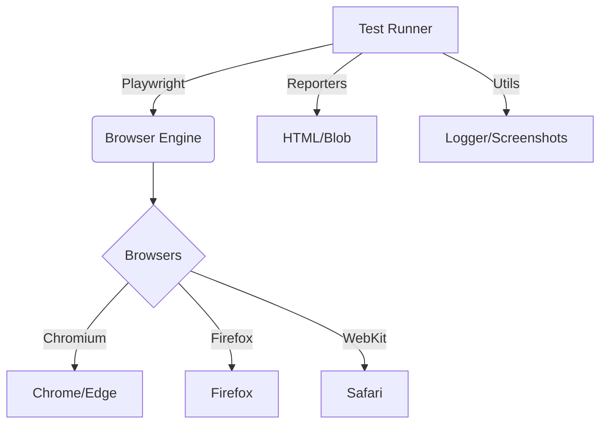

# E2E Test Automation Framework


## Overview

Enterprise-grade test automation framework for [SauceDemo](https://www.saucedemo.com) built with Playwright and TypeScript.



## Prerequisites

- Node.js 20+
- npm
- Docker (optional)

## Quick Start

1. **Clone the repository**

   ```bash
   git clone <repo-url>
   cd e2e-test-automation-framework
   ```

2. **Install dependencies**

   ```bash
   npm install
   npx playwright install --with-deps
   ```

3. **Configure Environment**

   ```bash
   cp .env.example .env
   ```

4. **Run Smoke Tests**
   ```bash
   npm run test:smoke
   ```

## Project Structure

- `src/pages`: Page Object Models
- `src/tests`: Test specifications
- `src/utils`: Helpers (Logger, Reports)
- `src/config`: Configuration and Test Data

## Scripts

| Script                     | Description       |
| -------------------------- | ----------------- |
| `npm test`                 | Run all tests     |
| `npm run test:ui`          | Run UI tests only |
| `npm run test:performance` | Run K6 load test  |

## CI/CD Pipeline

The project uses GitHub Actions for CI/CD.

- Triggers on push/PR to main/develop
- Runs tests in parallel (sharded)
- Merges reports
- Uploads artifacts

## Contributing

See [CONTRIBUTING.md](CONTRIBUTING.md) for guidelines.

## License

MIT
