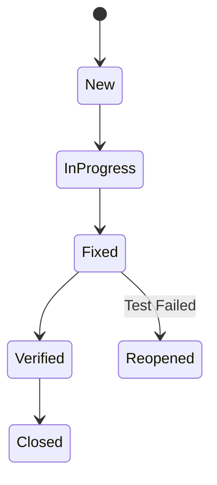

# Test Plan & Defect Workflow

## Test Plan
1. **Entry Criteria**: Code frozen, Environment ready.
2. **Exit Criteria**: 100% Critical tests passed, 0 Critical bugs.

## Defect Workflow

## Severity Definitions
- **S1 (Blocker)**: System down, data loss.
- **S2 (Critical)**: Main feature broken.
- **S3 (Major)**: Workaround available.
- **S4 (Minor)**: Cosmetic.
