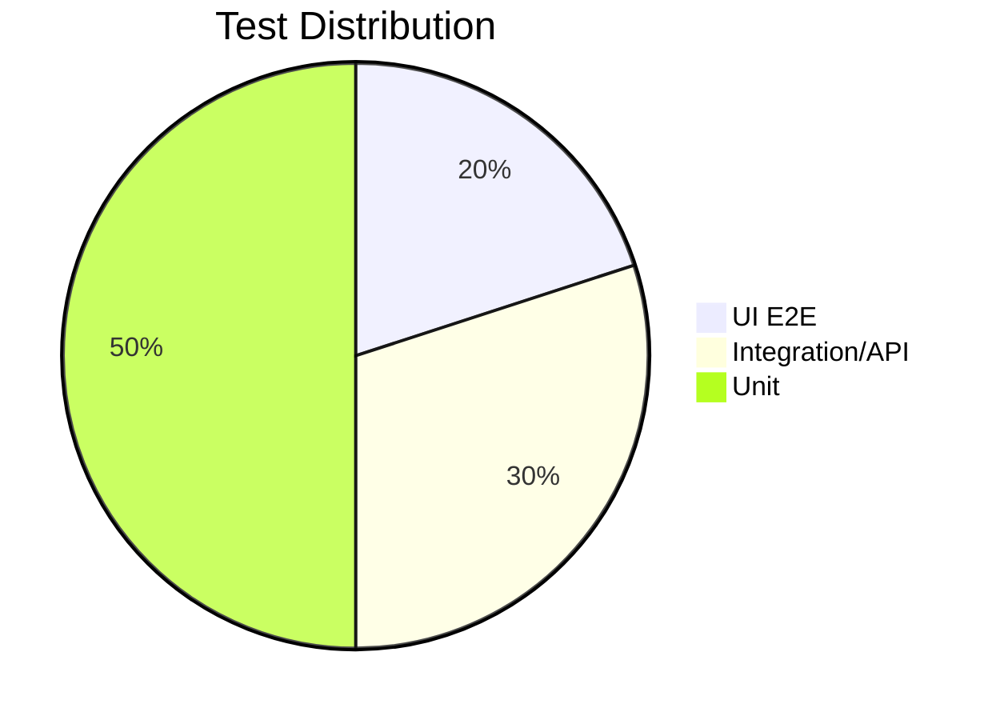

# Test Strategy & Coverage Plan

## Executive Summary
This document outlines the test strategy for the SauceDemo e-commerce platform.

## Scope
- **In-Scope**: Login, Product Catalog, Cart, Checkout, API Authentication.
- **Out-of-Scope**: Third-party integrations, Social media links.

## Test Pyramid

## Automation Coverage Matrix

| Feature | UI | API | Performance |
|---------|----|-----|-------------|
| Login | Yes | Yes | Yes |
| Cart | Yes | Yes | No |
| Checkout| Yes | No | Yes |

## Risk-Based Testing
- Critical: Checkout flow (High business value)
- High: Login (Gatekeeper)
- Medium: Sorting products

## CI/CD Integration
Tests run on every PR to prevent regression.
